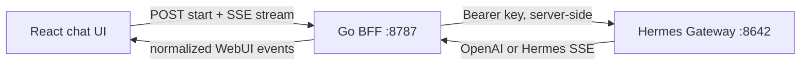

# Hermes Web Studio

A lightweight, modern UI for Hermes Agent. This repository is a compatibility-first rewrite of [`nesquena/hermes-webui`](https://github.com/nesquena/hermes-webui) using React, TypeScript, Tailwind CSS v4, shadcn-style owned primitives, and a small Go gateway bridge.

The first vertical slice is chat. It connects the browser to a locally running Hermes Gateway without exposing the Gateway API key to the browser.

## MVP status

- Modern responsive dashboard shell
- Session-shaped chat UI and streaming assistant messages
- Go BFF with `/api/chat/start`, `/api/chat/stream`, `/api/chat/cancel`
- Hermes Gateway `/v1/chat/completions` adapter
- Translation for OpenAI chunks and Hermes native stream events
- Health endpoint and connection status
- Mock Gateway integration tests
- Detailed migration plan and agent-ready task backlog

The remaining WebUI features are deliberately represented in the navigation but disabled until their parity gates are complete. See [plan.md](./plan.md) and [TASKS.md](./TASKS.md).

## Requirements

- Node.js 22+
- pnpm 11+
- Go 1.23+
- A running Hermes Gateway/API Server, normally on `http://127.0.0.1:8642`

## Quick start

```bash
cp .env.example .env
make dev
```

`make dev` starts the Go API on port `8787` and Vite on port `5173`. Vite proxies `/api` and `/health` to Go.

Configure the gateway when it differs from the defaults:

```bash
export HERMES_WEBUI_GATEWAY_BASE_URL=http://127.0.0.1:8642
export HERMES_WEBUI_GATEWAY_API_KEY=your-gateway-key
export HERMES_WEBUI_DEFAULT_MODEL=default
make dev
```

The API key is read only by the Go server. Never use a `VITE_*` variable for secrets.

## Verification

```bash
make test
make build
```

To test against a real Hermes instance:

```bash
HERMES_WEBUI_GATEWAY_BASE_URL=http://127.0.0.1:8642 \
HERMES_WEBUI_GATEWAY_API_KEY=your-gateway-key \
./scripts/smoke-hermes.sh
```

Run the safe M1 session/chat parity probe with the BFF and Gateway running:

```bash
./scripts/m1-live-parity.sh
```

It uses an isolated timestamped session, exercises session metadata actions and
transcript truncation, sends a no-tools prompt, and deletes the temporary
session on exit. It does not verify structured approval or tool execution.

## Production baseline

Build the multi-stage image and run it behind your TLS-terminating ingress:

```bash
make prod-image
docker run --rm -p 8080:8080 \
  -e HERMES_WEBUI_GATEWAY_BASE_URL=http://host.docker.internal:8642 \
  -e HERMES_WEBUI_GATEWAY_API_KEY=your-gateway-key \
  hermes-web-studio:local
```

Open `http://127.0.0.1:8080`. Nginx serves the production frontend and proxies the Go API, including unbuffered SSE. Put TLS, authentication, and external rate limiting at the deployment ingress before exposing this beyond a trusted machine. Do not put the Gateway key in a `VITE_*` variable.

## Architecture



The BFF owns credentials, cancellation, event normalization, and future persistence. The frontend consumes a stable compatibility contract rather than coupling components directly to Gateway event variants.
