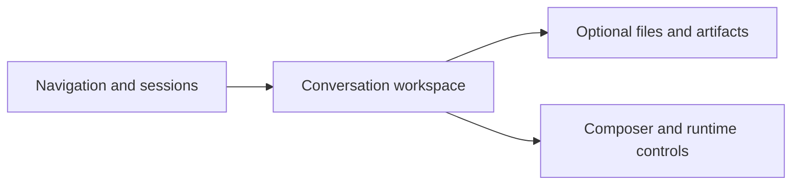
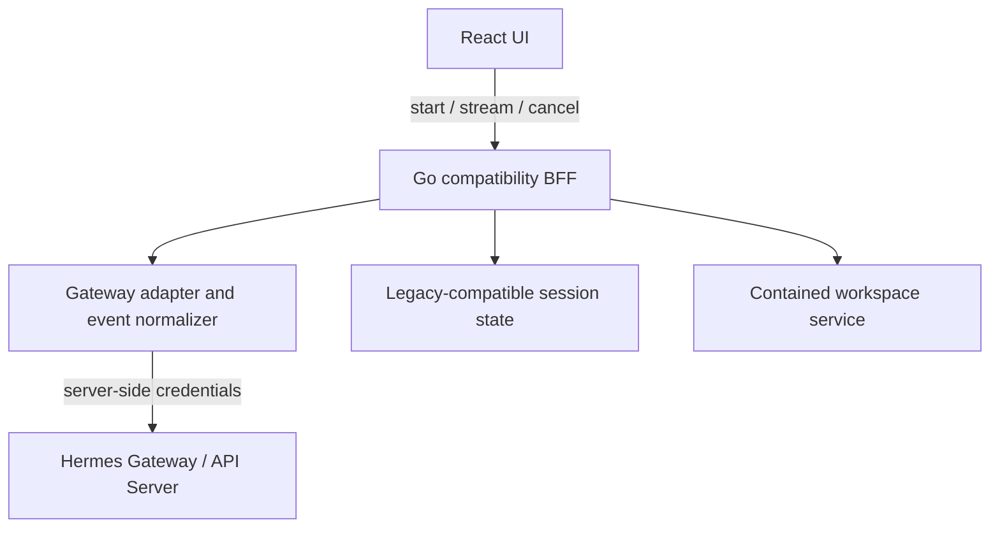

# Hermes Web Studio migration plan

> Status: M0 implementation started  
> Target repository: `adityahimaone/hermes-web-studio`  
> Compatibility baseline: `nesquena/hermes-webui@e168b67e4278df618d1cab61fdb3a8dc55b29a81`  
> Strategy: working Hermes chat first, then compatibility slices  
> Updated: 2026-08-30

## 1. Outcome

Hermes Web Studio will become a lightweight, modern replacement for Hermes WebUI. It may improve the visual design using a shadcn dashboard system and Tailwind CSS v4, but it must preserve the original product’s workflows, feature responsibilities, session continuity, security boundaries, and Hermes capabilities.

The migration is successful only when a user can replace the original UI without losing a required workflow. A visually polished shell alone is not a completed migration.

## 2. Decisions that supersede the earlier draft

The attached draft remains useful, with these deliberate changes:

| Earlier draft | Current decision |
|---|---|
| Pixel parity and no redesign | Modern shadcn dashboard is allowed; preserve composition and flow rather than pixels |
| Design shell before integration | Hermes chat connection is milestone M0 and blocks broad migration |
| Choose CLI subprocess or Gateway later | Gateway/API Server is the primary boundary; CLI is only a documented fallback experiment |
| Broad Go backend rewrite starts immediately | Implement thin Go compatibility BFF first; port persistence and domains slice by slice |
| Approximate original feature list | Freeze and audit a specific upstream commit; every feature gets a parity record |

## 3. Product principles

1. **Connection before decoration.** The first usable release must send a real message to Hermes and stream its response.
2. **Preserve capability and flow.** Redesign surfaces, not user intent or behavior.
3. **Compatibility at boundaries.** Normalize Gateway variants and preserve stable browser contracts.
4. **Credentials remain server-side.** No Gateway, provider, OAuth, or tool secret may enter frontend bundles.
5. **Vertical slices.** Every milestone includes UI, API, state, errors, tests, docs, and migration notes.
6. **Small runtime.** Prefer Go standard library, platform APIs, copy-owned shadcn primitives, and narrowly scoped packages.
7. **Reversible cutover.** Keep the original WebUI available until full parity and migration proof.
8. **Evidence-based completion.** Mock tests prove contracts; only a live test proves Hermes connectivity.

## 4. Target stack

### Frontend

| Concern | Choice |
|---|---|
| Build | Vite + TypeScript |
| UI | React 19 |
| Styling | Tailwind CSS v4, CSS-first tokens |
| Components | Copy-owned shadcn-style primitives |
| Server state | TanStack Query |
| Routes | TanStack Router when the second full route lands |
| Icons | Lucide React |
| Markdown | react-markdown, followed by syntax/Mermaid hardening in M1 |
| Unit tests | Vitest |
| E2E/visual | Playwright in M1 |

### Backend

| Concern | Choice |
|---|---|
| Runtime | Go 1.23+ |
| HTTP | Standard `net/http` until route composition justifies chi |
| Hermes | Gateway/API Server adapter |
| Streaming | Native SSE with `http.Flusher` |
| Persistence | SQLite with pure-Go driver in M1 |
| Distribution | One embedded Go binary before M3 exit |

The initial Go service is intentionally a BFF, not an immediate rewrite of every Python subsystem. This lowers integration risk and lets each domain be ported with a compatibility test.

## 5. Target composition

The visual language becomes a focused modern agent dashboard, while preserving the original three-region model:



### Desktop

- Left: product navigation, session/project organization, profile context.
- Center: chat timeline, tool/reasoning/approval cards, composer.
- Right: collapsible workspace, previews, artifacts, git context.

### Mobile

- Chat remains primary.
- Navigation opens as a sheet.
- Workspace opens as a separate sheet.
- Controls remain at least 44 px and keyboard-safe.

### Design rules

- Start with one neutral dark theme and semantic tokens.
- Add inherited skins only after the component API stabilizes.
- Never encode status only by color.
- Streaming updates must not cause major layout jumps.
- Disabled future navigation must say “Soon”; it must not look functional.

## 6. Runtime architecture



### Why Gateway-first

The original Python WebUI can import Hermes in process. Go cannot. Hermes Gateway already exposes the stable cross-runtime path and the original WebUI itself supports this mode. The BFF retains browser compatibility and owns the API key, event normalization, cancellation, health diagnostics, and future approvals.

### Gateway connection contract

- Upstream URL: `POST {HERMES_WEBUI_GATEWAY_BASE_URL}/v1/chat/completions`
- Streaming: `stream: true`
- Authorization: bearer key from `HERMES_WEBUI_GATEWAY_API_KEY`, fallback `API_SERVER_KEY`
- Continuity: `X-Hermes-Session-Id` and `X-Hermes-Session-Key: webui:{session_id}`
- Default URL: `http://127.0.0.1:8642`
- Default model: `default`

The adapter accepts:

- OpenAI-compatible `choices[0].delta.content`
- `message.delta`
- `reasoning.available`
- `tool.started` and `tool.completed`
- `run.completed` and `run.failed`
- `[DONE]`

The frontend receives only the normalized contract documented in `docs/compatibility-contract.md`.

## 7. M0 chat vertical slice

### Implemented foundation

- Modern dashboard shell and mobile-safe chat surface
- Typed frontend chat state and event reducer
- Gateway health indicator
- Chat start, SSE subscription, cancellation, safe errors
- Token streaming, reasoning disclosure, tool activity cards
- Mock Gateway integration tests
- Live-Hermes smoke script

### M0 acceptance gate

M0 is complete only when all conditions are true:

1. `go test ./...` passes.
2. `pnpm test` passes.
3. `pnpm build` passes.
4. The server can start with no API key and reports a useful offline state.
5. The mock Gateway test proves request body, auth header, session headers, streaming tokens, terminal event, redacted 401, and cancellation.
6. An operator starts a real Hermes Gateway and runs `scripts/smoke-hermes.sh` successfully.
7. A browser message receives a real streamed Hermes reply.
8. Live proof is recorded in `TASKS.md`.

Broad M1 work must not begin before conditions 6–8 are complete.

## 8. Compatibility inventory

Each row becomes a slice with a contract, implementation, tests, migration note, and rollback note.

| Domain | Required preserved behavior | Milestone |
|---|---|---|
| Chat core | Stream, stop, retry, edit/regenerate, queued sends, reconnect | M0–M1 |
| Rich responses | Markdown, code copy/highlight, Mermaid, thinking | M1 |
| Tool execution | Tool progress/result, subagents, safe failure visibility | M1 |
| Approvals | Dangerous command cards, allow/deny/always, YOLO semantics | M1 |
| Attachments | Upload, persistence, multimodal payload, limits | M1 |
| Sessions | CRUD, title, search, grouping, pin, archive, tags, project | M1 |
| Session continuity | Existing JSON/SQLite, CLI bridge, lineage, replay | M1 |
| Export/share | Markdown/JSON/HTML export and share links | M1 |
| Workspace | Tree, breadcrumb, preview, write/rename/delete/upload | M2 |
| Workspace safety | Root containment, symlinks, inaccessible paths, limits | M2 |
| Git | Repository detection and status badges | M2 |
| Profiles | Active profile, model/provider, clone/config, health | M3 |
| Authentication | Password, cookie, passkeys, OIDC, trusted headers | M3 |
| Onboarding | First run and provider/Gateway diagnostics | M3 |
| Tasks | Cron/task CRUD, run, pause, history, alerts | M4 |
| Skills | List, inspect, activate/configure | M4 |
| Memory/notes | MEMORY.md, USER.md, external sources | M4 |
| Todos/goals | Todo and goal lifecycle | M4 |
| Spaces/projects | Project grouping and workspace association | M4 |
| Commands/voice | Slash completion and speech input/transcription | M4 |
| Background work | Background tasks, wakeups, notifications | M4 |
| Extensions | Plugin/extension status and integrations | M4 |
| Terminal | Terminal stream and lifecycle | M4 |
| Preferences | Themes, skins, locale, runtime settings | M4 |
| Distribution | Single binary, Docker, Nix, Windows/macOS/Linux | M5 |

The upstream repository is large and evolving. Before each domain starts, compare the frozen baseline with current upstream and classify additions as required parity, intentional deferment, or out of scope.

## 9. Milestones

### M0 — Real Hermes chat

Build and prove the smallest end-to-end path. No persistence dependency. See §7.

### M1 — Production chat parity

Add session persistence, session navigation, rich content, approvals through the Runs API, attachments, reconnect/replay, edits/retry, and context usage. Introduce SQLite only when the session contract has been inventoried.

Current implementation status: the chat parity slice, compatibility BFF, browser acceptance matrix, live chat/attachment/replay proof, and opt-in text-only Runs adapter are implemented. `TASKS.md` keeps session CRUD/edit, tool/subagent variants, and structured approval at `[~]` until their live/manual side-by-side scenarios are observed against Hermes.

Exit proof: an agreed chat scenario matrix passes side-by-side against the original WebUI, including stop/reconnect, tool success/failure, approval, and restored history.

### M2 — Workspace parity

Add the third panel and contained file operations. Treat path containment and symlink behavior as security-critical, not UI polish.

Exit proof: workspace safety tests derived from upstream pass on Linux, macOS, and Windows semantics.

### M3 — Identity and profiles

Add profiles, providers/models, password auth, onboarding, then passkeys and OIDC. Embed the built frontend into Go before milestone exit.

Exit proof: local and remote-access threat cases pass; no secret is present in frontend artifacts.

### M4 — Control center parity

Port tasks, skills, memory, todos/goals, spaces, voice, commands, background work, extensions, terminal, preferences, skins, and locales as independent slices.

Exit proof: all required inventory rows have an owner, test evidence, and parity disposition.

### M5 — Distribution and cutover

Complete state migration, rollback, single-command install, release binaries, Docker, Nix, docs, performance budgets, security review, and beta cutover.

Exit proof: existing users can upgrade, preserve state, validate the new UI, and roll back safely.

## 10. Data compatibility

Existing locations and environment variables remain product contracts:

- `~/.hermes/webui/`
- `~/.hermes/config.yaml` or `HERMES_CONFIG_PATH`
- `HERMES_HOME`
- `HERMES_WEBUI_*`
- CLI/state database bridges

Migration rules:

1. Never modify legacy data in place without a backup and version marker.
2. Readers ship before writers.
3. Unknown fields are preserved.
4. Migration is idempotent.
5. A rollback command restores the last compatible state.
6. Fixtures from real legacy versions are required before M1 exit.

## 11. Testing strategy

| Layer | Purpose | Required now |
|---|---|---|
| Go unit | Event parsing, config, security utilities | Yes |
| Go integration | Browser contract against mock Hermes Gateway | Yes |
| Frontend unit | Event reducer, error/terminal states | Yes |
| Frontend component | Composer, tool cards, accessibility | M1 |
| E2E | Browser to mock Gateway | M1 |
| Live smoke | Browser/API to real Hermes | M0 gate |
| Contract parity | Old and new endpoint fixtures | M1 onward |
| Visual regression | Responsive dashboard and skins | M1 onward |
| Security | Auth, origin, path containment, upload limits | By domain |
| Performance | Bundle, idle RAM, stream latency, long sessions | Every milestone |

Initial performance budgets:

- Frontend initial JS target: under 250 KiB gzip before Markdown/Mermaid lazy chunks.
- Go idle RSS target: under 80 MiB excluding Hermes Gateway.
- No full conversation refetch per token.
- First normalized token overhead target: under 50 ms beyond upstream on localhost.

Budgets must be measured and updated with evidence; they are not assumed from stack choice.

## 12. Security model

- Bind to loopback by default.
- Require auth before supporting non-loopback deployment.
- Never return upstream response bodies that may contain secrets.
- Allow Gateway base URL only from server configuration.
- Cap request, upload, scanner, and decompression sizes.
- Apply path containment after resolving symlinks.
- Add CSRF/origin checks before cookie auth.
- Scrub tokens from logs and test snapshots.
- Keep tool approval policy owned by Hermes; the UI only represents and relays decisions.

## 13. Agent execution protocol

Every implementing agent must:

1. Read `AGENTS.md`, this file, `TASKS.md`, and the relevant compatibility docs.
2. Pick one unchecked task or one tightly coupled vertical slice.
3. Audit the corresponding upstream files and tests at the frozen SHA.
4. Write or update the compatibility contract before changing behavior.
5. Implement loading, empty, success, failure, cancellation, and responsive states.
6. Add automated evidence.
7. Run formatting, tests, and build relevant to the slice.
8. Update `TASKS.md` status accurately.
9. Add a decision record when changing architecture or scope.
10. Avoid marking `[x]` if live/manual proof is still needed; use `[~]`.

Agents must not:

- Start a later milestone to avoid a failing gate.
- Replace Hermes behavior with mocked production behavior.
- expose server secrets through `VITE_*` variables.
- delete compatibility code because it looks unused without upstream audit.
- combine redesign, protocol changes, and data migration in one unverifiable change.

## 14. Pull request template for migration slices

Each change description should include:

```md
### Slice
Task ID / milestone:

### Original behavior
Upstream files and tests:

### New behavior
Contract and UI changes:

### Evidence
- [ ] Unit
- [ ] Integration
- [ ] Browser/E2E
- [ ] Live Hermes (when applicable)

### Compatibility
Preserved / intentionally changed / deferred:

### Risk and rollback
```

## 15. Current blockers and explicit non-claims

- Live Hermes proof is available for chat, attachment/multimodal transport, replay, the opt-in Runs stream, session branch semantics, and tool activity. The Gateway advertises approval events, but explicit safe approval/delegation probes returned tool/text outcomes without structured approval or subagent events; no destructive command was executed.
- Session CRUD/edit, tool/subagent variants, and structured approval remain `[~]` in `TASKS.md` until live/manual side-by-side parity scenarios are observed.
- Runs mode is intentionally text-only in the adapter; attachment turns fall back to legacy chat completions until an upstream multimodal Runs input contract is verified.
- The production container baseline exists, but the frontend is not yet embedded in the Go binary; embedding remains M5 work.
- Navigation labels beyond Chat are roadmap placeholders, not functioning features.

These limits are surfaced in the UI/docs and tracked in `TASKS.md`; none should be presented as completed parity.
